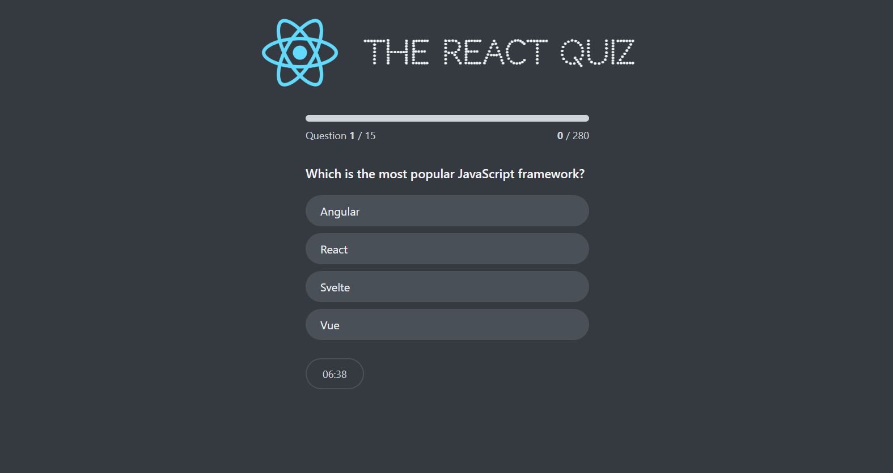

# React Quiz App

A modern, interactive quiz application built with React that tests your knowledge of React concepts. The app features a timer, progress tracking, and a scoring system.

## Features

- ⚡ Dynamic quiz questions loaded from an API
- ⏱️ Timer for each question
- 📊 Progress tracking
- 🎯 Score calculation
- 🎯 High score system
- 🎨 Modern and responsive UI
- 🔄 Quiz restart functionality

## Technologies Used

- React.js
- CSS3
- JavaScript (ES6+)
- Vite
